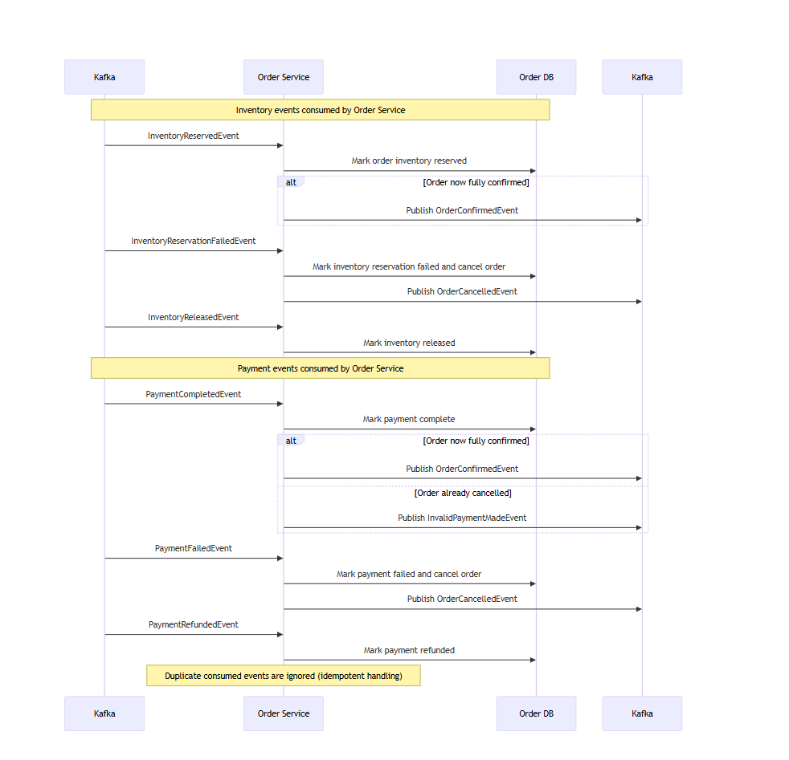

# Order Service

The Order Service manages the lifecycle of customer orders within the Product Orders microservices platform.
It creates orders, publishes order events to Kafka, and updates order status based on asynchronous events received from
other services.

## Responsibilities

- Creates and persists orders
- Publish order domain events to Kafka
- Consumes payment and inventory events to update order status
- Provides order history

## Architecture Role

The order service consumes events from other services to create and update orders. It also has API methods to retrieve
order history which is used by the ui layer.

## Tech Stack

| Technology      | Purpose               |
|-----------------|-----------------------|
| Java 17         | Runtime               |
| Spring Boot     | Application framework |
| Spring Data JPA | Database access       |
| Kafka           | Event messaging       |
| MySQL           | Order storage         |
| Flyway          | Database migrations   |
| Docker          | Containerization      |

## Environment Variables

An example list of environment variables is found in [`.env.example`](.env.example).

## Running the Service

Run the service using `docker-compose up --build` from [the root directory](../). To run this service in isolation, copy
the order service and mysql from the root [docker-compose](../docker-compose.yaml) file and run them separately. The
service will run on port 8081.

## API Methods

Base path: `/orders`

### 1) Create order

- **Method:** `POST`
- **Path:** `/orders`
- **Description:** Creates a new order from the provided customer and item payload.
- **Response:** `201 Created`

Example request:

{
"items": [
{
"productId": "<product-uuid>",
"productName": "Wireless Mouse",
"quantity": 2,
"unitPriceCents": 2999
}
],
"customerId": "<customer-uuid>",
"customerEmail": "<customer-email>",
"customerAddress": "<customer-address>",
"totalAmountCents": 5998,
"currency": "USD"
}

Example response:

{
"orderId": "<order-uuid>",
"customerId": "<customer-uuid>",
"customerEmail": "<customer-email>",
"customerAddress": "<customer-address>",
"totalAmountCents": 5998,
"currency": "USD"
}

### 2) Get order by ID

- **Method:** `GET`
- **Path:** `/orders/{orderId}`
- **Description:** Returns details and current status for one order.
- **Path parameter:**
    - `orderId` (UUID) — Order identifier
- **Response:** `200 OK`

Example response:

{
"orderId": "<order-uuid>",
"items": [
{
"productId": "<product-uuid>",
"productName": "Wireless Mouse",
"quantity": 2,
"unitPriceUSDCents": 2999
}
],
"customerId": "<customer-uuid>",
"customerEmail": "<customer-email>",
"customerAddress": "<customer-address>",
"totalAmountUSDCents": 5998,
"currency": "USD",
"status": "CREATED",
"progress": "AWAITING_PAYMENT_AND_INVENTORY_RESERVATION",
"paymentStatus": "PENDING",
"createdAt": "2026-03-06T12:00:00Z"
}

### 3) Get orders for customer

- **Method:** `GET`
- **Path:** `/orders/customer/{customerId}`
- **Description:** Returns the order history for the specified customer.
- **Path parameter:**
    - `customerId` (UUID) — Customer identifier
- **Response:** `200 OK`

Example response:

[
{
"orderId": "<order-uuid>",
"items": [
{
"productId": "<product-uuid>",
"productName": "Wireless Mouse",
"quantity": 2,
"unitPriceUSDCents": 2999
}
],
"customerId": "<customer-uuid>",
"customerEmail": "<customer-email>",
"customerAddress": "<customer-address>",
"totalAmountUSDCents": 5998,
"currency": "USD",
"status": "CONFIRMED",
"progress": "COMPLETED",
"paymentStatus": "COMPLETED",
"createdAt": "2026-03-06T12:00:00Z"
}
]

## Order Lifecycle

Orders are processed asynchronously using a small saga across the Order, Inventory, and Payment services.

When an order is first created:

- `order_status = CREATED`
- `inventory_status = PENDING`
- `payment_status = PENDING`
- `progress = AWAITING_PAYMENT_AND_INVENTORY_RESERVATION`

From there, inventory and payment are completed independently. The order is only fully confirmed when **both** of these conditions are true:

- inventory has been reserved
- payment has completed

### 1) Order created

A client creates an order through the API.

The Order Service:

- validates the request
- verifies the submitted total matches the sum of item prices
- persists the order and its line items
- stores customer details
- publishes an `OrderCreatedEvent`

Initial persisted state:

- `status`: `CREATED`
- `inventoryStatus`: `PENDING`
- `paymentStatus`: `PENDING`
- `progress`: `AWAITING_PAYMENT_AND_INVENTORY_RESERVATION`

### 2) Inventory reservation succeeds first

If the Inventory Service reserves stock before payment completes:

- `inventoryStatus` becomes `RESERVED`
- `paymentStatus` remains `PENDING`
- `status` remains `CREATED`
- `progress` becomes `AWAITING_PAYMENT`

The order is not yet confirmed at this point because payment is still outstanding.

### 3) Payment completes first

If the Payment Service completes payment before inventory is reserved:

- `paymentStatus` becomes `COMPLETED`
- `inventoryStatus` remains `PENDING`
- `status` remains `CREATED`
- `progress` becomes `AWAITING_INVENTORY_RESERVATION`

The order is still not confirmed yet because inventory has not been secured.

### 4) Successful confirmation

The order becomes fully confirmed when the second successful event arrives:

- inventory becomes `RESERVED` while payment is already `COMPLETED`, or
- payment becomes `COMPLETED` while inventory is already `RESERVED`

Final confirmed state:

- `status`: `CONFIRMED`
- `inventoryStatus`: `RESERVED`
- `paymentStatus`: `COMPLETED`
- `progress`: `CONFIRMED`

At that point, the Order Service publishes an `OrderConfirmedEvent`.

### 5) Inventory reservation fails

If inventory reservation fails before the order is confirmed:

- `inventoryStatus` becomes `FAILED`
- `status` becomes `CANCELLED`

Typical resulting progress:

- `CANCELLED_INVENTORY_RESERVATION_FAILED`

The Order Service publishes an `OrderCancelledEvent` so downstream services can perform compensation if needed.

### 6) Payment fails

If payment fails before the order is confirmed:

- `paymentStatus` becomes `FAILED`
- `status` becomes `CANCELLED`

Typical resulting progress:

- `CANCELLED_PAYMENT_FAILED`

The Order Service publishes an `OrderCancelledEvent`.

### 7) Payment completed after the order was already cancelled

A payment-completed event can arrive after the order has already been cancelled, for example because inventory failed first.

In that case:

- the order remains `CANCELLED`
- `paymentStatus` may still be `COMPLETED`
- `progress` becomes `CANCELLED_AWAITING_PAYMENT_REFUND`

The Order Service then publishes an `InvalidPaymentMadeEvent` so the payment can be refunded.

### 8) Compensation after cancellation

After cancellation, other services may emit cleanup events that update the order record:

#### Inventory released
If reserved stock is released:

- `inventoryStatus` becomes `RELEASED`

#### Payment refunded
If a completed payment is refunded:

- `paymentStatus` becomes `REFUNDED`

These updates help the order reflect the full compensation state after a failed saga.

### Progress summary

The order exposes a derived `progress` field that summarizes the combined order, payment, and inventory state into a more useful business-level status:

- `AWAITING_PAYMENT_AND_INVENTORY_RESERVATION`
- `AWAITING_PAYMENT`
- `AWAITING_INVENTORY_RESERVATION`
- `CONFIRMED`
- `CANCELLED_AWAITING_PAYMENT_REFUND`
- `CANCELLED_INVENTORY_RESERVATION_FAILED`
- `CANCELLED_PAYMENT_FAILED`

### Important behavior notes

- Order confirmation is **event-driven**, not immediate at create time.
- Payment and inventory can complete in **either order**.
- A confirmed order cannot later be cancelled through failure events.
- Consumed payment and inventory events are handled **idempotently** so duplicates do not corrupt order state.

## Database Schema

#### `order_customer_details`

- `id` `bigint(20)` — **PK**, auto increment
- `customer_id` `binary(16)` — not null
- `customer_address` `varchar(2000)` — not null
- `customer_email` `varchar(255)` — not null

#### `order_table`

- `order_id` `binary(16)` — **PK**
- `currency` `varchar(3)` — not null
- `amount_cents` `bigint(20)` — nullable
- `created_at` `datetime(6)` — not null
- `updated_at` `datetime(6)` — not null
- `customer_details_id` `bigint(20)` — not null, **FK** -> `order_customer_details.id`
- `version` `bigint(20)` — nullable (optimistic locking/versioning)
- `inventory_status` `enum('FAILED','PENDING','RELEASED','RESERVED')` — not null
- `order_status` `enum('CANCELLED','CONFIRMED','CREATED')` — not null
- `payment_status` `enum('COMPLETED','FAILED','PENDING','REFUNDED')` — not null
- Index: `fk_order_table_cdi_ocd_idx (customer_details_id)`

#### `order_item`

- `id` `bigint(20)` — **PK**, auto increment
- `order_id` `binary(16)` — not null, **FK** -> `order_table.order_id`
- `product_id` `binary(16)` — not null
- `quantity` `int(11)` — not null
- `name_snapshot` `varchar(255)` — not null
- `amount_cents` `bigint(20)` — nullable
- `unit_price_currency` `varchar(255)` — nullable
- Unique constraint: `uk_order_item_order (order_id, product_id)`

#### `processed_inventory_event`

- `id` `bigint(20)` — **PK**, auto increment
- `event_id` `binary(16)` — unique (`uk_pie_event_id`)
- `processed_at` `datetime(6)` — not null

#### `processed_payment_event`

- `id` `bigint(20)` — **PK**, auto increment
- `event_id` `binary(16)` — unique (`uk_ppe_event_id`)
- `processed_at` `datetime(6)` — not null

### Relationship overview

    order_customer_details (1) ---- (N) order_table
                    id              customer_details_id

    order_table (1) ---- (N) order_item
           order_id         order_id

### Notes

- `order_table` stores the main order aggregate, including overall order, inventory, and payment state.
- `order_item` stores a snapshot of products included in the order at the time it was created.
- `processed_inventory_event` and `processed_payment_event` support idempotent event consumption by recording
  already-handled Kafka events.

## Notes on security

Protected endpoints expect a JWT:

- `Authorization: Bearer <token>`

The JWT signature is verified using the Auth Service’s JWKS endpoint.